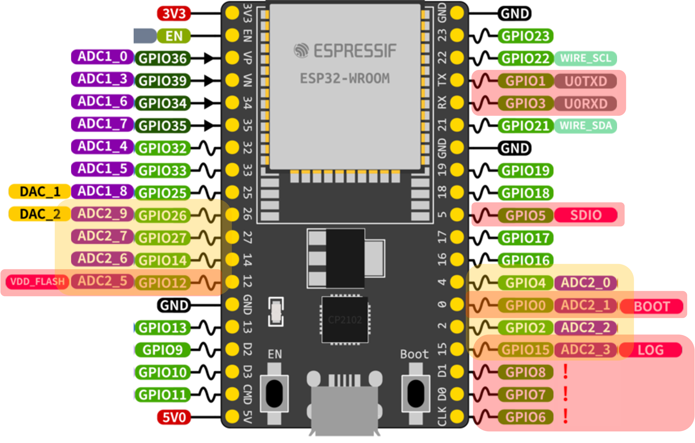

## ESP32 ADC Data Storage Example

This project demonstrates how to safely store and retrieve integer values (such as ADC readings) in non-volatile storage (NVS) on the ESP32 using FreeRTOS tasks and queues for thread safety.

### Hardware Pin Connections
| Peripheral    | Channel          | Pins |
| ------------- | ---------------- | ---- |
| ADC           | ADC_CHANNEL_6    |  34  |

#### SPI Channel 3
|  Function     | Pin  |
| ------------- | ---- |
| CS            | 5    |
| SCLK          | 18   |
| MOSI          | 23   |
| MISO          | 19   |


### Project Structure

- **main/**
  - `main.c`: Application entry point. Initializes the storage handler, sensor handler, and starts the blink task.
- **sensor_module/**
  - `sensor_handler.c/h`: Manages registration and polling of sensor read functions. Starts a FreeRTOS task to periodically read all registered sensors.
  - `adc/adc_sensor.c/h`: Provides ADC initialization, reading, and deinitialization using the ESP-IDF ADC oneshot driver. Includes validation and error handling.
- **storage_handler/**
  - `storage_handler.c/h`: Implements a thread-safe storage handler using a FreeRTOS queue and a dedicated handler task. Provides APIs to write and read integer values to/from NVS in a specified namespace and key.
- **images/**
  - `ESP32.jpg`, `ESP32Pinout.png`: Board and pinout images for reference.

### Key Components

- **storage_handler.c / storage_handler.h**: Thread-safe NVS storage handler using a FreeRTOS queue and handler task. APIs:
    - `storage_handler_write(namespace, key, value)`: Queues a write request to NVS.
    - `storage_handler_read(namespace, key, &value)`: Queues a read request from NVS.
    - `storage_handler_start()`: Initializes the handler task and queue. Call this once in `app_main` before using the handler.
- **sensor_handler.c / sensor_handler.h**: Registers sensor read functions and periodically calls them in a FreeRTOS task. Used to poll sensors like ADC.
- **adc/adc_sensor.c / adc_sensor.h**: Abstraction for ADC operations. Handles initialization, reading, and deinitialization of ADC units/channels. Includes validation and error handling.
- **main.c**: Sets up and starts the storage handler, sensor handler, and a simple GPIO blink task using FreeRTOS. The sensor handler registers the ADC sensor and periodically reads its value.

### How It Works

- All NVS operations are performed in a single handler task to ensure thread safety.
- Other tasks communicate with the handler via a FreeRTOS queue, sending read/write requests.
- The handler notifies the requesting task of the operation result using task notifications.
- The NVS namespace and key are user-defined strings (e.g., `adc_ns`, `adc_val`).
- The sensor handler manages periodic polling of registered sensors (e.g., ADC).

### Usage

1. Call `storage_handler_start()` once at startup.
2. Use `storage_handler_write()` and `storage_handler_read()` from any task to store or retrieve integer values in NVS.
3. Use `sensor_init()` to initialize and register sensors (e.g., ADC) for periodic polling.

### Error Handling

- All NVS and queue operations are logged. Errors are reported with ESP-IDF error codes for easy debugging.
- ADC and sensor errors are logged with details.

### Requirements

- ESP-IDF 5.4.1 (ESP32 development framework)
- FreeRTOS (included in ESP-IDF)

---

### Hardware Used

- ESP32 WROOM 32 Kit


---

### Pinout



---
For more details, see the comments in the respective source files and ESP-IDF documentation on NVS, FreeRTOS, and ADC.

### Issues Faced and Solutions in Linux

#### Configuration Issues
  ```/home/$USER/.espressif/tools/openocd-esp32/v0.10.0-esp32-20190708/openocd-esp32/share/openocd/contrib/60-openocd.rules doesn't exists.```

  ```bash
  sudo mkdir -p /etc/udev/rules.d/
  sudo wget -O /etc/udev/rules.d/60-openocd.rules https://raw.githubusercontent.com/espressif/openocd-esp32/master/contrib/60-openocd.rules
  sudo udevadm control --reload-rules
  ```
#### Flash Issues
- Run: sudo usermod -aG dialout $USER
- Run: `lsusb` to see if your FTDI device appears.
  - If not, unplug/replug and try a different USB port/cable.
  - If it appears, but OpenOCD still fails, you may need a udev rule:
    - Create a file `/etc/udev/rules.d/99-ftdi.rules` with:
      ```
      SUBSYSTEM=="usb", ATTR{idVendor}=="10c4", ATTR{idProduct}=="ea60", MODE="0666"
      ```
    - Then run:
      ```bash
      sudo udevadm control --reload-rules
      sudo udevadm trigger
      ```
    - Unplug and replug your debugger.

### Install ESP IDF and Dependencies

#### Install Dependencies
``` bash 
sudo apt-get install git wget flex bison gperf python3 python3-pip python3-venv cmake ninja-build ccache libffi-dev libssl-dev dfu-util libusb-1.0-0
```
---
#### Clone ESP IDF
``` bash
mkdir -p ~/esp
cd ~/esp
git clone -b v5.4.1 --recursive https://github.com/espressif/esp-idf.git
```
---

### Setup Tools

``` bash
cd ~/esp/esp-idf
./install.sh esp32
```

#### Build

``` bash
cd <Working Directory>
source $HOME/esp/esp-idf/export.sh
idf.py build
```

#### Flash

``` bash
idf.py -p PORT flash
```

#### Reference
https://docs.espressif.com/projects/esp-idf/en/stable/esp32/get-started/linux-macos-setup.html

https://www.espressif.com/sites/default/files/documentation/esp32_technical_reference_manual_en.pdf